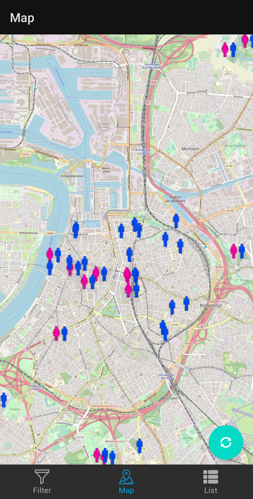

# PooClue
Toilet app to see nearby toilets in Antwerp

## Map
- User can view all nearby toilets with their gender
- 

## Filter
- User can filter by gender, for disabled access, and by changing tables.
- Changes will be displayed on the Map and List component accordingly
- 

## List
- Shows all nearby toilets
- Shows how many meters away it is from your current position
- 